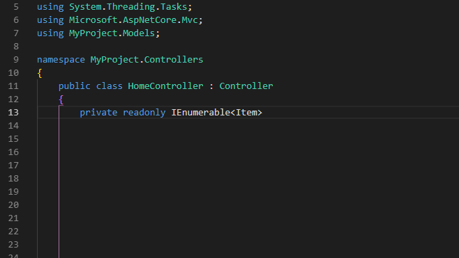

# C# Underscored Field Name Suggestions

> Deprecated. Use OmniSharp's .editorconfig support.
> - Enable: https://github.com/OmniSharp/omnisharp-roslyn/releases/tag/v1.33.0
> - Example config file: https://github.com/dotnet/roslyn/blob/master/.editorconfig#L102

## See it in action

